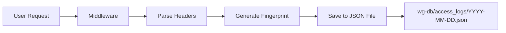

# Access Logging System - Dokumentasi

## Deskripsi

Sistem logging aktivitas user yang menyimpan semua request ke server dengan informasi device lengkap untuk keperluan audit dan forensik.

> **Note:** Access Logs sekarang terintegrasi ke halaman **Monitoring** (tab "Access Logs").

---

## Cara Kerja



### Device Fingerprint

Device fingerprint dibuat dari hash SHA-256 kombinasi:

- IP Address
- User-Agent
- Accept-Language

Ini menghasilkan ID unik 12 karakter untuk setiap device.

---

## API Endpoints

### 1. Get Access Logs

```
GET /api/access-logs
```

**Query Parameters:**

| Parameter            | Type   | Description                         |
| -------------------- | ------ | ----------------------------------- |
| `limit`              | number | Jumlah log (default: 100, max: 500) |
| `ip`                 | string | Filter by IP address                |
| `device_fingerprint` | string | Filter by device ID                 |
| `path`               | string | Filter by request path              |
| `start_date`         | string | ISO date string                     |
| `end_date`           | string | ISO date string                     |

**Response:**

```json
{
  "success": true,
  "logs": [
    {
      "id": "1768446480170-0bzn46",
      "timestamp": "2026-01-15T03:08:00.170Z",
      "ip": "::1",
      "method": "GET",
      "path": "/dashboard",
      "browser": "Chrome",
      "os": "macOS",
      "device": "Desktop",
      "deviceFingerprint": "ea70495e0c3d",
      "acceptLanguage": "en-US,en;q=0.9",
      "referer": "http://localhost:3000/"
    }
  ],
  "total": 1
}
```

---

### 2. Get Access Log Statistics

```
GET /api/access-logs/stats
```

**Query Parameters:**

| Parameter | Type   | Description                    |
| --------- | ------ | ------------------------------ |
| `days`    | number | Periode statistik (default: 7) |

**Response:**

```json
{
  "success": true,
  "stats": {
    "totalRequests": 150,
    "uniqueIPs": 5,
    "uniqueDevices": 3,
    "topPaths": [{ "path": "/dashboard", "count": 45 }],
    "topDevices": [
      {
        "fingerprint": "ea70495e0c3d",
        "browser": "Chrome",
        "os": "macOS",
        "device": "Desktop",
        "count": 80
      }
    ],
    "requestsByHour": [
      { "hour": 0, "count": 5 },
      { "hour": 1, "count": 2 }
    ],
    "period": "7 days"
  }
}
```

---

### 3. Delete Old Logs

```
DELETE /api/access-logs
```

**Request Body:**

```json
{
  "days_to_keep": 30
}
```

---

## Data Storage

### Lokasi File

```
wg-db/access_logs/
├── 2026-01-13.json
├── 2026-01-14.json
└── 2026-01-15.json
```

### Format Log Entry

```typescript
interface AccessLog {
  id: string;
  timestamp: string; // ISO 8601
  ip: string; // IP address
  method: string; // GET, POST, etc
  path: string; // Request path
  userAgent: string; // Full user agent string
  browser: string; // Chrome, Firefox, Safari, etc
  os: string; // Windows, macOS, Linux, Android, iOS
  device: string; // Desktop, Mobile, Tablet
  deviceFingerprint: string; // 12-char unique ID
  username?: string; // Logged-in user (if available)
  sessionId?: string; // Session ID (if available)
  acceptLanguage?: string; // Browser language
  referer?: string; // Previous page
  statusCode?: number; // HTTP status code
}
```

---

## Forensic Use Cases

### 1. Investigasi Device Tertentu

```bash
curl "http://localhost:3000/api/access-logs?device_fingerprint=ea70495e0c3d&limit=100"
```

### 2. Investigasi IP Address

```bash
curl "http://localhost:3000/api/access-logs?ip=192.168.1.100"
```

### 3. Investigasi Time Range

```bash
curl "http://localhost:3000/api/access-logs?start_date=2026-01-14&end_date=2026-01-15"
```

### 4. Investigasi Path Tertentu

```bash
curl "http://localhost:3000/api/access-logs?path=/admin"
```

---

## Konfigurasi

### Environment Variables

| Variable            | Default   | Description     |
| ------------------- | --------- | --------------- |
| `WIREGUARD_DB_PATH` | `./wg-db` | Lokasi database |

### Constants (di accessLog.ts)

| Constant           | Value | Description       |
| ------------------ | ----- | ----------------- |
| `MAX_DAYS_TO_KEEP` | 30    | Retention period  |
| `MAX_LOGS_PER_DAY` | 10000 | Max logs per file |

---

## Frontend UI

Akses halaman **Monitoring** → tab **Access Logs** untuk melihat:

- Tabel access logs real-time
- Filter by IP, Device ID, Path
- Top devices section
- Statistik (total requests, unique IPs, unique devices)

Alternatif, data juga bisa diakses via API untuk integrasi dengan tools lain.

---

## Maintenance

### Manual Cleanup

```bash
curl -X DELETE http://localhost:3000/api/access-logs \
  -H "Content-Type: application/json" \
  -d '{"days_to_keep": 7}'
```

### Check Log Files

```bash
ls -la wg-db/access_logs/
cat wg-db/access_logs/$(date +%Y-%m-%d).json | jq '.[0]'
```
